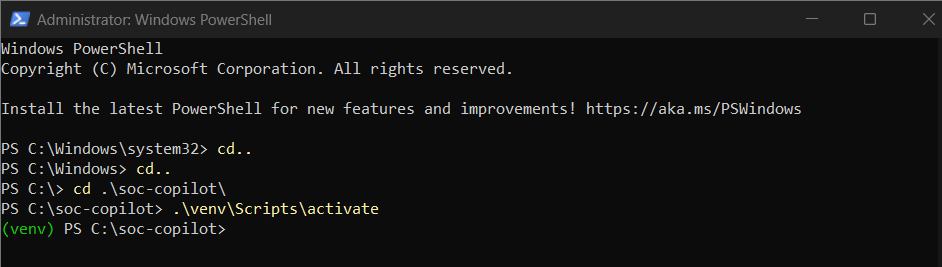
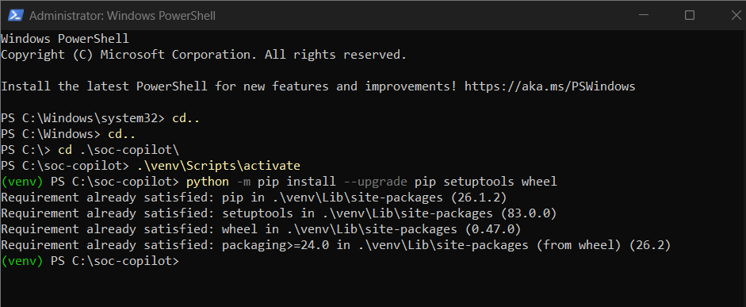
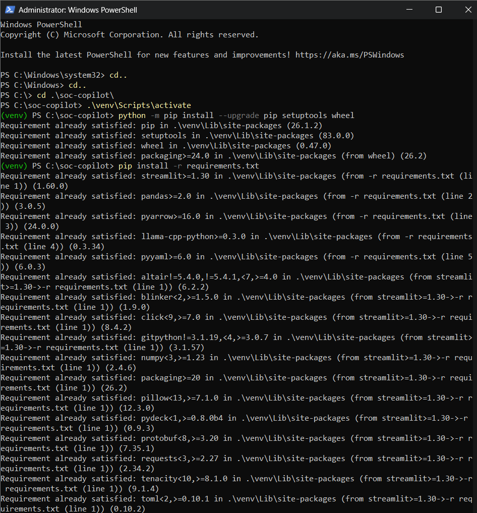
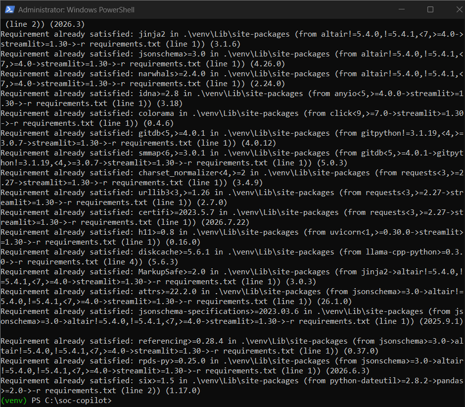
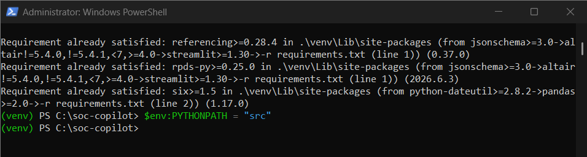
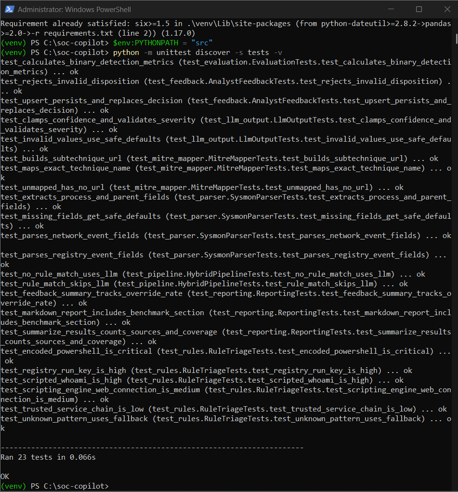
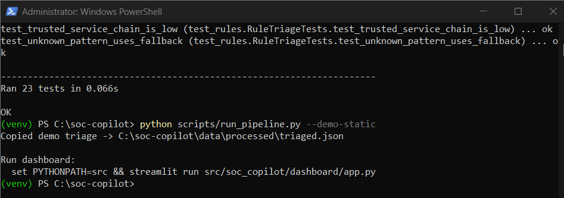
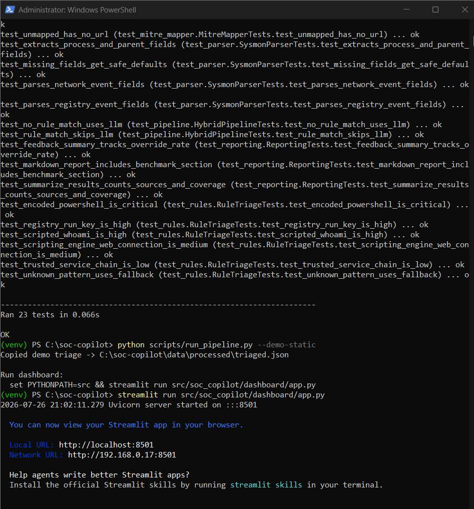
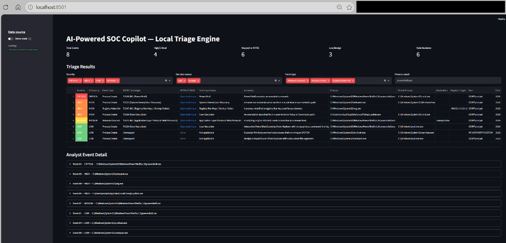

# AI SOC Copilot

Local, AI-assisted security event triage pipeline for Windows Sysmon logs. Built as a portfolio lab project demonstrating SOC analyst workflows, MITRE ATT&CK mapping, measurable detection performance, and privacy-preserving LLM inference.

[](https://www.python.org/)
[](.github/workflows/ci.yml)
[](https://www.microsoft.com/windows)
[](#what-it-does)
[](#license)

## What it does

```
Sysmon (EID 1/3/12/13)  →  export  →  parse  →  rules  →  LLM fallback  →  MITRE map  →  dashboard
```

1. **Export** configured Sysmon process, network, and registry events from the Windows Event Log
2. **Parse** raw messages into event-specific structured fields
3. **Triage** high-signal patterns with explainable rules, then use a local Phi-3 model for unmatched events
4. **Map** LLM technique guesses to MITRE ATT&CK IDs
5. **Visualize** results, evaluation metrics, and analyst decisions in an interactive dashboard

## Project structure

```
soc-copilot/
├── config/settings.yaml       # Paths, model, export settings
├── src/soc_copilot/           # Application package
│   ├── export/                # Sysmon log export
│   ├── parse/                 # Sysmon message parser
│   ├── triage/                # Explainable rules + LLM fallback
│   ├── mitre/                 # MITRE ATT&CK mapper
│   ├── evaluation.py          # Accuracy, precision, recall, F1
│   ├── feedback.py            # Analyst overrides and disposition
│   └── dashboard/             # Streamlit UI
├── scripts/                   # CLI entry points
├── data/samples/              # Sanitized demo dataset (safe to publish)
├── data/raw/                  # Live exported events (gitignored)
├── data/processed/            # Live triage output (gitignored)
└── assets/mitre_techniques.json  # Slim MITRE index (~800 KB)
```

## Section 1: What you need to install first

This section is for first-time setup on a new Windows machine.

If you only want a quick demo:
- You need Python and Git
- You can skip Sysmon and Atomic Red Team

### Step 0: Install base software

Install these tools before running any project command:

1. Python 3.10 or newer (from [python.org](https://www.python.org/downloads/windows/))
2. Git for Windows (from [git-scm.com](https://git-scm.com/download/win))
3. Optional for live telemetry: Sysmon
4. Optional for attack simulation: Atomic Red Team PowerShell module

Verify Python and Git:
```powershell
python --version
git --version
```
Expected: both commands print version numbers.

### Step 1: Download this project

If you are cloning from GitHub:
```powershell
cd C:\
git clone https://github.com/0xPR4V33N/soc-copilot.git
cd soc-copilot
```
What it does: downloads the project and opens the project folder.

If you already downloaded as ZIP:
```powershell
cd C:\soc-copilot
```
What it does: opens your extracted project folder.

### Step 2: Create and activate Python environment

```powershell
python -m venv venv
.\venv\Scripts\activate
```
What it does: creates an isolated Python environment and activates it.

Expected: prompt starts with `(venv)`.

### Step 3: Install Python libraries for this project

```powershell
python -m pip install --upgrade pip setuptools wheel
pip install -r requirements.txt
```
What it does: updates package tools and installs all project dependencies.

Main libraries installed from `requirements.txt`:
- `streamlit`
- `pandas`
- `pyarrow`
- `llama-cpp-python`
- `pyyaml`

If you see `Requirement already satisfied`, that is also OK.

### Step 4: Set project source path and run sanity test

```powershell
$env:PYTHONPATH = "src"
python -m unittest discover -s tests -v
```
What it does: points Python to project source and confirms setup by running tests.

Expected: final output includes `OK`.

### Optional installs (only for live + manual trigger path)

Install Atomic Red Team module:
```powershell
Install-Module -Name Invoke-AtomicRedTeam -Scope CurrentUser -Force
Import-Module Invoke-AtomicRedTeam -Force
```

You also need:
- Sysmon installed and running
- Local model file at `models/phi3-mini-q4.gguf`

---

## Section 2: Step-by-step usage (choose your path)

Choose one path:
- Path A = easiest demo for portfolio screenshots
- Path B = real telemetry from your machine
- Path C = real telemetry plus manual attack simulation

Run this first in every new terminal session:
```powershell
cd C:\soc-copilot
.\venv\Scripts\activate
$env:PYTHONPATH = "src"
```

### Path A: Demo mode (quickest, no Sysmon, no model)

Use this if you want to present the project quickly with safe sample data.

Step A1:
```powershell
python scripts/run_pipeline.py --demo-static
```
Result: creates/updates `data\processed\triaged.json` from sample records.

Step A2:
```powershell
streamlit run src/soc_copilot/dashboard/app.py
```
Result: opens dashboard at `http://localhost:8501`.
Keep this terminal open while you use the dashboard.

### Path B: Live mode (real local Sysmon telemetry)

Use this if you want to process real events from your machine.

Before Path B:
- Do **not** skip Sysmon installation
- Do **not** skip model file in `models\`

Step B1:
```powershell
python scripts/run_pipeline.py
```
Result: exports Sysmon events and writes:
- `data\raw\events.json`
- `data\processed\triaged.json`

Step B2:
```powershell
streamlit run src/soc_copilot/dashboard/app.py
```
Result: dashboard shows live processed events.

### Path C: Live mode + manual attack trigger (lab simulation)

Use this when you want to generate detectable activity first, then triage it.

Step C1: Load Atomic module and set atomics path
```powershell
Import-Module Invoke-AtomicRedTeam -Force
$atomics = "C:\AtomicRedTeam\atomics"
```

Step C2: Trigger safe simulation tests
```powershell
Invoke-AtomicTest T1059.001 -TestNumbers 1 -PathToAtomicsFolder $atomics
Invoke-AtomicTest T1033 -TestNumbers 1 -PathToAtomicsFolder $atomics
Invoke-AtomicTest T1071.001 -TestNumbers 1 -PathToAtomicsFolder $atomics
Invoke-AtomicTest T1547.001 -TestNumbers 1 -PathToAtomicsFolder $atomics
```

Step C3: Run pipeline and dashboard
```powershell
python scripts/run_pipeline.py
streamlit run src/soc_copilot/dashboard/app.py
```
Result: dashboard should include newly generated suspicious events.

### What to skip based on your goal

- Demo only:
  - Skip Sysmon setup
  - Skip model download
  - Skip Atomic Red Team commands
- Live telemetry:
  - Skip demo command `--demo-static`
- Manual trigger:
  - Do not skip Atomic commands before running pipeline

### How to stop the dashboard

In the same terminal where Streamlit is running, press:
- `Ctrl + C`

### One-command helper (optional)

```powershell
.\scripts\setup_and_run.ps1 -Mode demo -RunTests -GenerateBenchmark -GenerateReport -StartDashboard
```

## Visual step-by-step (with screenshots)

Use this section if you want a quick visual guide without reading the full setup text.

### Step 1: Open folder and activate virtual environment

Command:
```powershell
cd C:\soc-copilot
.\venv\Scripts\activate
```
Expected: prompt starts with `(venv)`.



### Step 2: Upgrade Python package tools

Command:
```powershell
python -m pip install --upgrade pip setuptools wheel
```
Expected: `Requirement already satisfied` or `Successfully installed`.



### Step 3: Install all project dependencies

Command:
```powershell
pip install -r requirements.txt
```
Expected: dependency list appears and completes without error.




### Step 4: Set project source path for Python

Command:
```powershell
$env:PYTHONPATH = "src"
```
Expected: no error, returns to prompt.



### Step 5: Run test suite

Command:
```powershell
python -m unittest discover -s tests -v
```
Expected: final lines show `Ran ... tests` and `OK`.



### Step 6: Run pipeline in demo mode

Command:
```powershell
python scripts/run_pipeline.py --demo-static
```
Expected: output confirms demo triage file creation.



### Step 7: Start Streamlit dashboard

Command:
```powershell
streamlit run src/soc_copilot/dashboard/app.py
```
Expected: `Local URL: http://localhost:8501`.



### Step 8: Open dashboard in browser

Action:
- Open `http://localhost:8501`
- Verify event table, severities, MITRE columns, and event detail expanders



## Full pipeline options

```powershell
# Build MITRE index (one-time; if mitre_attack.json is available)
python scripts/build_mitre_index.py

# Use demo events but run hybrid triage code path
python scripts/run_pipeline.py --demo
```

## Configuration

Edit `config/settings.yaml` to change:

- Event export limits and types (`max_events`, `event_ids`)
- Model path and inference settings (`n_threads`, `temperature`)
- Input/output file paths

## Design notes

- **Local-first:** Logs and LLM inference stay on your machine — useful for sensitive environments
- **Hybrid triage:** Deterministic, high-confidence rules handle known patterns before the LLM is called
- **Explainable decisions:** Rule verdicts include rule IDs, confidence, and matched indicators
- **Human in the loop:** Analysts can confirm alerts, mark false positives, override severity, and record notes
- **Measured behavior:** Labeled samples expose severity accuracy, precision, recall, and F1
- **Structured parsing:** Sysmon messages are parsed once into reusable fields instead of fragile string splits
- **Structured triage schema:** Verdicts are stored as JSON objects (not double-encoded strings)
- **Slim MITRE index:** The full STIX bundle is not committed; a pre-built index loads in milliseconds
- **Demo dataset:** Sanitized events include both benign activity and simulated attack patterns (encoded PowerShell, recon chain, Temp execution)

## Detection rules

- `SOC-R001` — encoded PowerShell command (`T1059.001`), critical
- `SOC-R002` — `cmd.exe` spawning PowerShell (`T1059.001`), high
- `SOC-R003` — reconnaissance tools launched by a script host or from a user-writable path, high
- `SOC-R004` — executable launched from Temp or Downloads (`T1204`), high
- `SOC-R005` — scripting engine making a remote web connection (`T1071.001`), medium
- `SOC-R006` — registry Run-key modification (`T1547.001`), high
- `SOC-R100` — expected `services.exe` → `svchost.exe` SYSTEM chain, low

If no rule matches, the event is sent to the local LLM. This reduces unnecessary inference and avoids asking the model to identify patterns that can be detected deterministically.

## Safe attack simulations

The repository contains inert, sanitized Sysmon-style JSON records in `data/samples/`. They model:

1. Encoded PowerShell spawned by `cmd.exe`
2. `whoami /all` launched by PowerShell
3. An executable launched from a user Temp directory
4. PowerShell making a remote HTTPS connection
5. Registry Run-key persistence
6. Expected Windows service and interactive application control cases

These samples are telemetry only; the repository does not execute the represented commands. Use `python scripts/run_pipeline.py --demo-static` to present them without Sysmon or a model.

## Tests

Run the parser, rule engine, evaluation, feedback, MITRE mapper, and hybrid pipeline tests:

```powershell
$env:PYTHONPATH = "src"
python -m unittest discover -s tests -v
```

## Model benchmark (optional)

Compare your default model against another local GGUF model on the same labeled sample set:

```powershell
$env:PYTHONPATH = "src"
python scripts/benchmark_models.py --primary-name phi3 --secondary-model models\other-model.gguf --secondary-name other
```

This writes `reports/model_benchmark.json` with per-model runtime and quality metrics.

If you do not have a second model yet, you can still produce benchmark-style metrics from precomputed sample triage:

```powershell
$env:PYTHONPATH = "src"
python scripts/benchmark_models.py --primary-name sample-baseline --use-triaged data\samples\triaged.json
```

## Portfolio summary report

Generate a markdown report that summarizes triage volume, MITRE coverage, labeled metrics, analyst feedback, and optional benchmark results:

```powershell
$env:PYTHONPATH = "src"
python scripts/generate_report.py
```

This writes `reports/portfolio_summary.md`.

## Build a shareable portfolio bundle

```powershell
$env:PYTHONPATH = "src"
python scripts/build_portfolio_bundle.py --zip
```

This collects key artifacts into `portfolio/bundle_*` and optionally creates a zip archive.

## Continuous integration

GitHub Actions workflow at `.github/workflows/ci.yml` runs on pushes and pull requests:

- Install dependencies
- Validate sample JSON artifacts
- Execute the full unit test suite
- Compile Python sources for syntax checks

## Known limitations

- Rule coverage and the eight-event evaluation set are intentionally small; reported metrics are demonstrative, not production benchmarks
- LLM fallback can still hallucinate on unfamiliar or ambiguous system processes
- Rule confidence is a design-time heuristic, not a calibrated probability
- Analyst feedback is local JSON storage and does not support concurrent multi-user writes
- Model-to-model comparison requires a second local model and is not enabled by default
- Not a replacement for enterprise SIEM/EDR tooling

## License

Portfolio / educational use.
